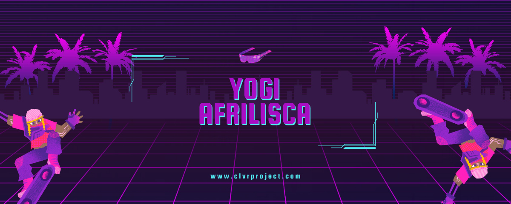

<h1 align="center">
    
</h1>

<h3 align="center">Passionate budding discord bot developer from Indonesia❤</h3>

 

 
 🔭 I’m currently work as a **freelancer**
 
 🌱 I'm currently learning **Discord.js, Node.js, JavaScript, Mysql, MongoB, Sqlite3.**

💬 Ask me about **Node.js, Discord.js, Mysql... or anything [here](https://github.com/YogiAfrilisca95/YogiAfrilisca95/issues)**

⚡ Fun fact **Hummingbird Heart Rate: Hummingbirds have very fast heart rates, reaching 1,200 beats per minute when flying.**

 

 

 
  
  
  <a href="https://yogiafrilisca95.github.io" target="_blank">
      <!-- sqlite, safari, google-chrome are other good icon options -->
  </a>

 

 
<h2 align="center">⚒️ Languages-Frameworks-Tools ⚒️</h2>
 

    
     

 

  <h2>🐍 My Contributions 🐍</h2>
   
  
  
     

<h2 align="center">⚡ Stats ⚡</h2>
 

  
  
   
  

  

 

 
